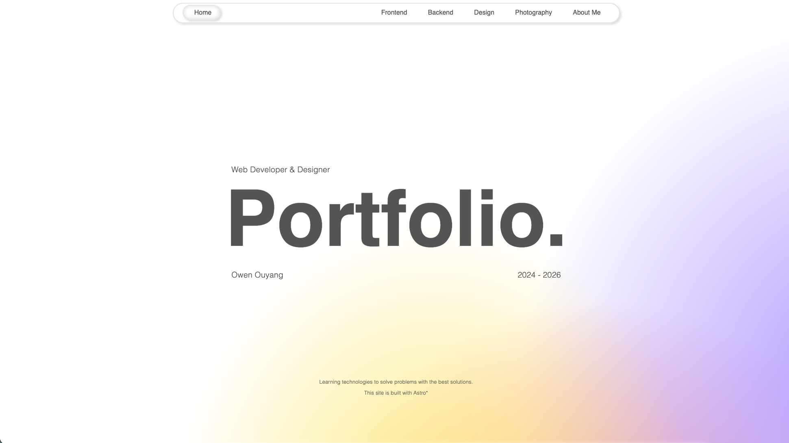
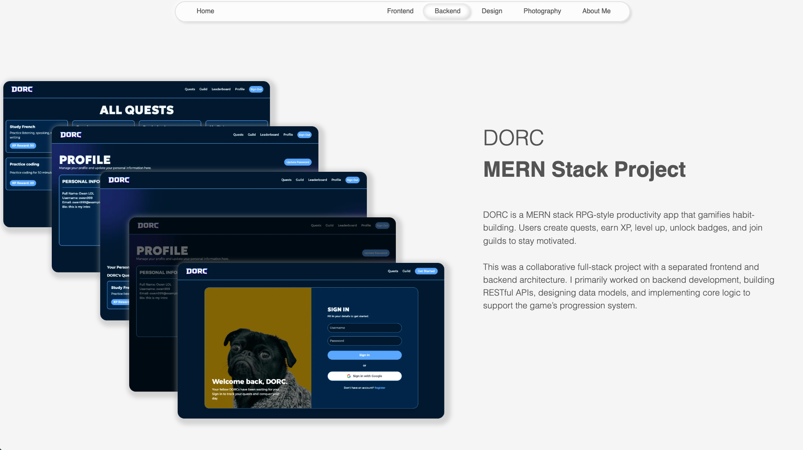

# Owen Ouyang — Portfolio

Personal portfolio site for **Web Developer & Designer** work: projects, design case studies, frontend and backend notes, photography, and an about section. The goal is to present work clearly while keeping the experience fast and pleasant to browse.

## Live Site

[Visit Live Portfolio Site - https://owen-ca.com](https://owen-ca.com)

<p align="center">
  
  
</p>

## Why Astro

This site is built with **Astro** because it suits a performance-focused portfolio: mostly static content with selective interactivity.

- Strong static output with minimal client JavaScript（fast loading）
- SEO-friendly routing and metadata support
- Islands architecture for interactive React components only
- Built-in image optimization for media-heavy pages
- Route prefetching for smoother navigation

Together, these strengths make Astro a strong fit for a fast, content-rich portfolio experience.

## Engineering Decisions

- Structured pages with reusable layouts and shared sections for long-term scalability
- Used `client:visible` to defer non-critical interactive components
- Prioritized above-the-fold assets with eager loading and lazy-loaded lower-priority media
- Tuned animations to balance visual polish with first-load performance

## Features

- Idea and project presentation homepage experience
- Dedicated Frontend / Backend / Design / Photography sections
- Story-driven about me section
- Responsive layout across desktop and mobile
- Smooth animations powered by GSAP and animation timelines
- Optimized assets for performance
- SEO-friendly routing and metadata

## Tech stack

| Area       | Notes                                                                                                        |
| ---------- | ------------------------------------------------------------------------------------------------------------ |
| Framework  | [Astro](https://astro.build/) 5                                                                              |
| UI islands | [React](https://react.dev/) 19 (`@astrojs/react`)                                                            |
| Styling    | [Tailwind CSS](https://tailwindcss.com/) 4, [Sass](https://sass-lang.com/), [shadcn](https://ui.shadcn.com/) |
| Motion     | [GSAP](https://gsap.com/)                                                                                    |
| Fonts      | [@fontsource-variable/geist](https://fontsource.org/)                                                        |
| Other      | Lucide icons, Radix UI                                                                                       |

## Getting started

Requirements: a current **Node.js** LTS version and a package manager (`npm`, `pnpm`, or `yarn`).

```bash
npm install
npm run dev
```

- **Development** — `npm run dev` starts the local dev server (localhost:4321).
- **Production build** — `npm run build` outputs the static site to `dist/`.
- **Preview build** — `npm run preview` serves `dist/` locally to verify the build.

## Project layout (high level)

- `src/pages/` — Routes (home, frontend, backend, design subpages, photography, about, etc.).
- `src/layouts/` — Shared page shells.
- `src/components/` — Reusable Astro (and island) pieces.
- `src/styles/` — Global SCSS and shared mixins.
- `public/` — Static assets referenced by URL path.

---

_“Learning technologies to solve problems with the best solutions.”_ — tagline on the live home page.
